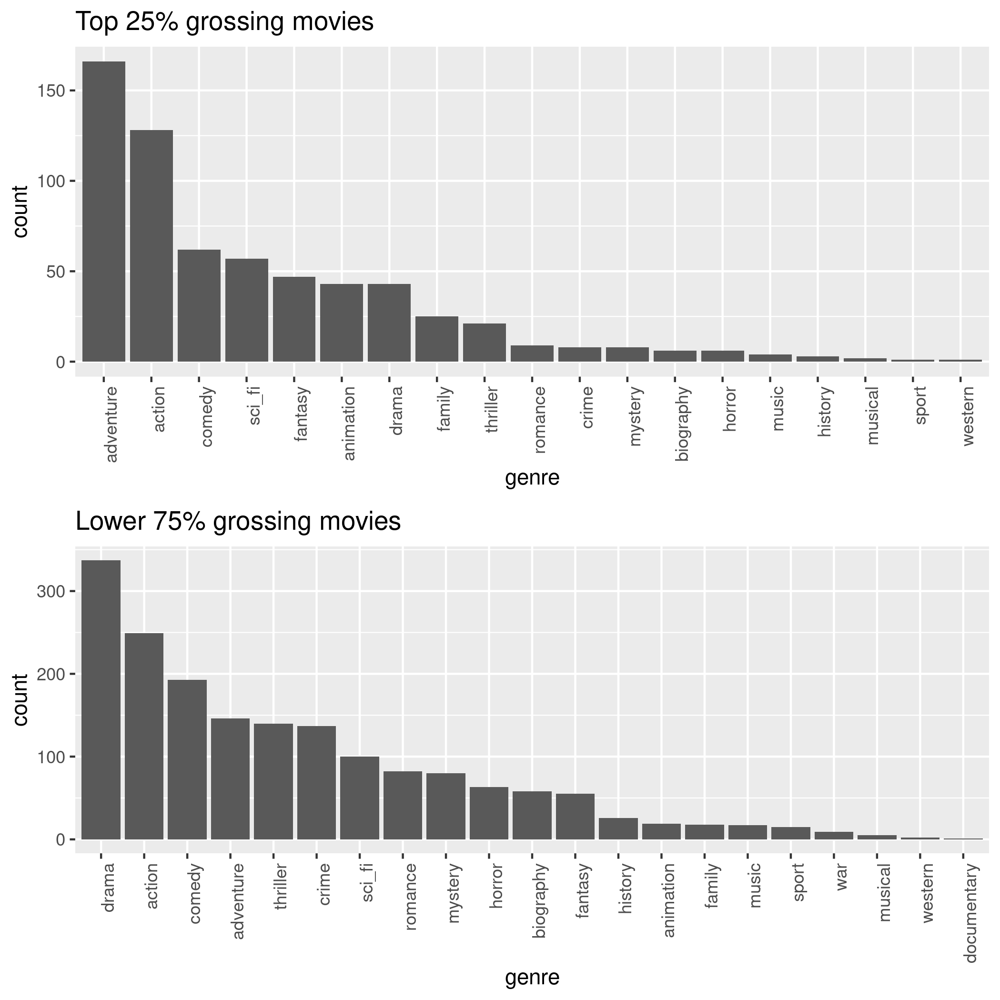
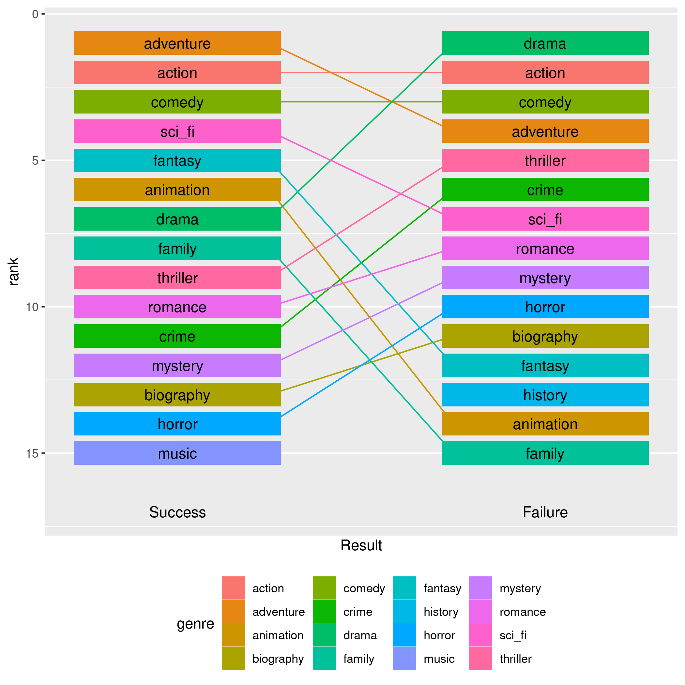

Bios 611 Project1
=================
IMDB MOVIE RATINGS ANALYSIS
-------------------------------

Proposal
--------

Introduction
------------
 Watching a movie is one of the most favorite hobbies these days.
It is interesting to see which movie genre is popular 

Dataset
--------
 The dataset I will use is publicly available on Kaggle. The address is "https://www.kaggle.com/pysaphal/imdb-20002019-movie-data-set-over-3000?select=df_movie_ratings.csv".
The dataset is scraped from IMDB and contains the information about movies released in the cinema between 2000 and 2019.
The variables of the data are movie title, gross, imdb user's rating, genres, released year, and so on.

 Each movie in the data normally belongs to one-to-three genres among total 21 genres.
Movies will be grouped into two groups by total gross, one is the top 25% grossing group and the other is the lower 75% grossing group.
The added 'result' variable in the wrangled dataset shows a group to which a movie belong. If a movie is in the top 25%, the movie will be considered as success, otherwise, as failure.

Preliminary Figures
-------------------

 The two histograms show that there is a difference of the distribution of the genres over gross. 

 The difference looks clearer in this figure. Some genres, such as fantasy, animation, and family, belongs to the list of top 10 in the success group.
However, they are below the 10th place in the failure group. 

Usage
------------------

 You will need Docker. You need to be able to run docker as your user.

    docker build . -t project1_env
    docker run -v `pwd`:/home/rstudio -p 8787:8787 -e PASSWORD=9779 -t project1_env

Makefile
--------

 To build the above preliminary figures relating to the distribution of genre over gross,\
enter the below command in Bash or Rstudio.

	make figures/freq_genre_by_result.png
	make figures/genre_comp_table_by_result.png

